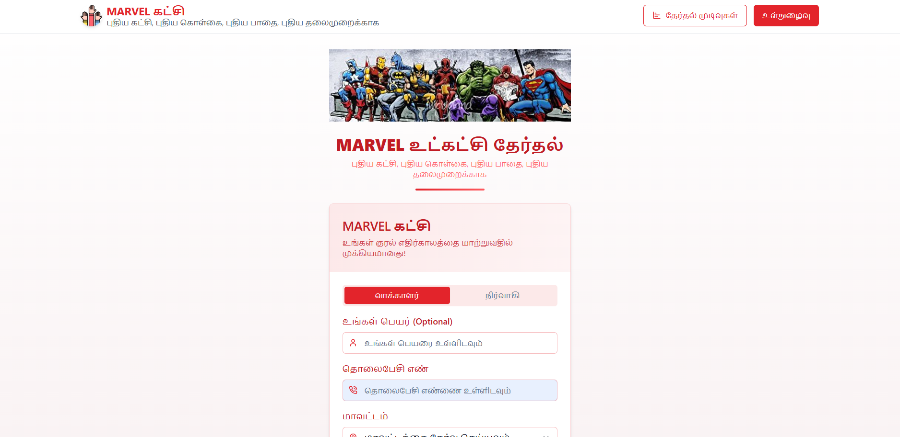

⭐ MARVEL கட்சி – Election Management System

A modern, streamlined, Tamil-supported digital platform for conducting and managing party elections.
📌 Overview

MARVEL கட்சி Election Management System is a web-based application designed to simplify and digitalize the internal election workflow of a political party.
It provides tools for voter authentication, candidate management, vote tracking, and result publishing—all through a clean, Tamil-friendly interface.

This system ensures transparency, accuracy, and convenience for both administrators and voters.

🚀 Features
🔐 Authentication

Admin Login

Voter Login

Secure credential validation

🗳️ Candidate Management

Add new candidates

Select district & constituency

View, edit, and remove candidates

Tamil localized interface

Clear and modern UI layout

📊 Voting & Results

Input vote counts per candidate

Track total votes

Auto-select and confirm winners

Publish results to dashboard

Real-time statistics display

📁 Admin Dashboard

Manage constituencies

Manage voter records

Candidate list preview

Result overview page

🖥️ User Interface

Fully responsive design

Tamil labels for accessibility

Easy navigation menus

Clean layout for all management pages

🏛️ System Pages
Page	Description
Home Page	Entry point with navigation options
Voter Login	Secure access for voters
Admin Login	Separate admin authentication
Register Candidate	Add new candidates with district/constituency
Manage Candidates	Edit or delete candidate profiles
Manage Votes	Update vote counts
Publish Results	Select & publish winners
Results Dashboard	Displays final results in structured format
⚙️ Tech Stack
Category	Technology
Frontend	HTML, CSS, JavaScript
Backend	Node.js / PHP (update based on your project)
Database	MySQL / MongoDB (update accordingly)
Version Control	Git & GitHub
Language Support	English + Tamil

(Tell me your exact backend & database to update this.)

📸 Screenshots

You can add your image files like this:

If you want, I can format and arrange your screenshots in a beautiful grid.
